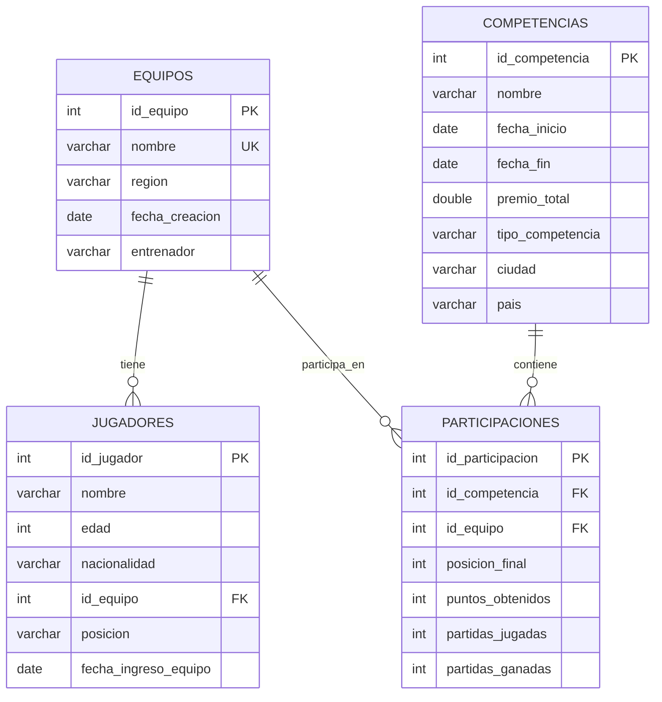

<div align="center">

# 🎮 eSports Tournament Database System

### 🏆 Sistema de Gestión de Torneos & Análisis Competitivo

[](https://www.mysql.com/)
[](https://github.com/TU-USUARIO/esports-db)
[](https://github.com/TU-USUARIO/esports-db)
[](LICENSE)


</div>

---

## 📋 Tabla de Contenidos

- [🎯 Descripción del Proyecto](#-descripción-del-proyecto)
- [🏗️ Arquitectura del Modelo](#️-arquitectura-del-modelo)
- [📊 Diagrama Entidad-Relación](#-diagrama-entidad-relación)
- [🔧 Características Técnicas](#-características-técnicas)
- [📁 Diccionario de Datos](#-diccionario-de-datos)
- [🚀 Instalación y Configuración](#-instalación-y-configuración)
---

## 🎯 Descripción del Proyecto

Este proyecto implementa un **sistema de base de datos relacional** robusto y escalable para la gestión integral de torneos de eSports. El modelo está diseñado bajo principios de normalización estrictos, garantizando **integridad referencial**, **eliminación de redundancias** y **alta performance** en consultas analíticas.

### 🌟 Objetivos Clave

```sql
-- Objetivo Principal
CREATE DATABASE esports_tournaments
  CHARACTER SET utf8mb4
  COLLATE utf8mb4_unicode_ci;

/* 
✓ Garantizar integridad de datos
✓ Eliminar redundancias mediante normalización 3NF
✓ Facilitar análisis estadísticos complejos
✓ Optimizar rendimiento de consultas
*/
```

<div align="center">

| 🎯 Meta | ✅ Estado | 📊 Impacto |
|---------|-----------|------------|
| **Normalización 3NF** | Completado | Alto |
| **Integridad Referencial** | Implementado | Crítico |
| **Optimización de Queries** | Activo | Alto |
| **Documentación Completa** | Disponible | Medio |

</div>

---

## 🏗️ Arquitectura del Modelo

<div align="center">



</div>

### 📐 Normalización Aplicada

<table>
<tr>
<td width="33%" valign="top">

#### 1️⃣ Primera Forma Normal (1NF)
✅ **Atributos atómicos**
- Todos los atributos son atómicos
- No hay listas ni estructuras repetitivas
- Cada celda contiene un único valor
- Estadísticas por fila en `participaciones`

```sql
-- ✓ Correcto: valores atómicos
nombre VARCHAR(100)
fecha_inicio DATE
posicion_final INT

-- ✗ Evitado: valores múltiples
-- estadisticas TEXT (JSON anidado)
```

</td>
<td width="33%" valign="top">

#### 2️⃣ Segunda Forma Normal (2NF)
✅ **Sin dependencias parciales**
- Cumple 1NF completamente
- No hay claves primarias compuestas con dependencias parciales
- Relación N:M descompuesta en `participaciones` con PK propia

```sql
-- Tabla intermedia con PK única
CREATE TABLE participaciones (
  id_participacion INT PRIMARY KEY,
  id_competencia INT NOT NULL,
  id_equipo INT NOT NULL,
  -- atributos dependen de toda la PK
  UNIQUE(id_competencia, id_equipo)
);
```

</td>
<td width="33%" valign="top">

#### 3️⃣ Tercera Forma Normal (3NF)
✅ **Sin dependencias transitivas**
- Cumple 2NF completamente
- Sin dependencias transitivas entre atributos no clave
- Datos del equipo no se repiten en `jugadores` (solo FK)
- Datos del torneo no se copian en `participaciones`
- Nombres únicos evitan duplicidad lógica

```sql
-- Información maestra separada
-- jugadores solo referencia equipos
id_equipo INT FK

-- participaciones solo referencia
-- competencias y equipos
id_competencia INT FK
id_equipo INT FK
```

</td>
</tr>
</table>

---

## 📊 Diagrama Entidad-Relación

<div align="center">

### 🗺️ Modelo Conceptual Completo

```
┌─────────────────────────┐         ┌──────────────────────────┐         ┌─────────────────────────┐
│       EQUIPOS           │         │     PARTICIPACIONES      │         │      COMPETENCIAS       │
├─────────────────────────┤         ├──────────────────────────┤         ├─────────────────────────┤
│ 🔑 id_equipo            │◄────────┤ 🔗 id_equipo            │────────►│ 🔑 id_competencia       │
│    nombre (UNIQUE)      │         │ 🔗 id_competencia        │         │    nombre               │
│    region               │         │    posicion_final        │         │    fecha_inicio         │
│    fecha_creacion       │         │    puntos_obtenidos      │         │    fecha_fin            │
│    entrenador           │         │    partidas_jugadas      │         │    premio_total         │
└─────────────────────────┘         │    partidas_ganadas      │         │    tipo_competencia     │
        │ 1:N                        └──────────────────────────┘         │    ciudad               │
        │                             UNIQUE(id_competencia,              │    pais                 │
        │                                    id_equipo)                    └─────────────────────────┘
        ▼
┌─────────────────────────┐
│       JUGADORES         │
├─────────────────────────┤
│ 🔑 id_jugador           │
│    nombre               │
│    edad                 │
│    nacionalidad         │
│ 🔗 id_equipo            │
│    posicion             │
│    fecha_ingreso_equipo │
└─────────────────────────┘
```

### 🔗 Descripción de Relaciones

**Entidades principales:**
- **Equipos (1)** ← **Jugadores (N)**: Un equipo tiene múltiples jugadores
- **Competencias (1)** ↔ **Participaciones (N)** ↔ **Equipos (1)**: Relación N:M materializada

**Tabla intermedia:**
- `participaciones` materializa la relación **N:M** entre competencias y equipos
- Incluye atributos de resultado: posición, puntos y partidas

</div>

<table align="center">
<tr>
<td align="center"><strong>Relación</strong></td>
<td align="center"><strong>Cardinalidad</strong></td>
<td align="center"><strong>Descripción</strong></td>
</tr>
<tr>
<td>Equipos → Jugadores</td>
<td><code>1:N</code></td>
<td>Un equipo tiene múltiples jugadores (roster)</td>
</tr>
<tr>
<td>Equipos ↔ Competencias</td>
<td><code>N:M</code></td>
<td>Equipos participan en múltiples torneos y viceversa</td>
</tr>
<tr>
<td>Participaciones (intermedia)</td>
<td><code>-</code></td>
<td>Materializa N:M con datos de resultados</td>
</tr>
</table>

---

## 🔧 Características Técnicas

<div align="center">

### 💎 Implementación de Calidad

</div>

<table>
<tr>
<td width="50%" valign="top">

### 🔐 Integridad de Datos

```sql
-- Claves Primarias con Auto-incremento
ALTER TABLE equipos
  ADD PRIMARY KEY (id_equipo),
  MODIFY id_equipo INT AUTO_INCREMENT;

-- Claves Foráneas con Acciones en Cascada
ALTER TABLE jugadores
  ADD CONSTRAINT fk_jugador_equipo
  FOREIGN KEY (id_equipo)
  REFERENCES equipos(id_equipo)
  ON DELETE SET NULL
  ON UPDATE CASCADE;

ALTER TABLE participaciones
  ADD CONSTRAINT fk_participacion_equipo
  FOREIGN KEY (id_equipo)
  REFERENCES equipos(id_equipo)
  ON DELETE CASCADE;

ALTER TABLE participaciones
  ADD CONSTRAINT fk_participacion_competencia
  FOREIGN KEY (id_competencia)
  REFERENCES competencias(id_competencia)
  ON DELETE CASCADE;

-- Restricción de Unicidad Crítica
ALTER TABLE participaciones
  ADD CONSTRAINT uk_equipo_competencia
  UNIQUE (id_competencia, id_equipo);
```

#### ✅ Beneficios Implementados:
- 🛡️ Prevención de registros huérfanos
- 🚫 **Impide duplicar un equipo en un mismo torneo**
- 🔄 Actualizaciones automáticas en cascada
- ⚠️ Validación de reglas de negocio

</td>
<td width="50%" valign="top">

### 📏 Reglas de Negocio

```sql
-- REGLA 1: Un equipo no puede participar
-- dos veces en la misma competencia
CONSTRAINT uk_equipo_competencia
  UNIQUE (id_competencia, id_equipo);

-- REGLA 2: Nombre único por equipo
ALTER TABLE equipos
  ADD CONSTRAINT uk_nombre_equipo
  UNIQUE (nombre);

-- REGLA 3: Fechas lógicas de competencia
CHECK (fecha_fin >= fecha_inicio);

-- REGLA 4: Valores numéricos válidos
CHECK (posicion_final > 0);
CHECK (puntos_obtenidos >= 0);
CHECK (partidas_ganadas <= partidas_jugadas);
CHECK (edad > 0 AND edad < 100);
```

#### 📋 Validaciones Implementadas:
- ✓ Sin duplicados en inscripciones
- ✓ Nombres únicos de equipos
- ✓ Rangos de fechas coherentes
- ✓ Partidas ganadas ≤ jugadas
- ✓ Edades razonables de jugadores

</td>
</tr>
</table>

---

## 📁 Diccionario de Datos

<div align="center">

### 📚 Catálogo Completo de Tablas y Columnas

</div>

---

### 🏢 Tabla: `equipos`

**Descripción:** Catálogo maestro de equipos participantes, con región, fecha de creación y entrenador.

```sql
CREATE TABLE equipos (
    id_equipo      INT          PRIMARY KEY AUTO_INCREMENT NOT NULL,
    nombre         VARCHAR(100) UNIQUE NOT NULL,
    region         VARCHAR(50)  NULL,
    fecha_creacion DATE         NULL,
    entrenador     VARCHAR(100) NULL,
    INDEX idx_region (region),
    INDEX idx_nombre (nombre)
) ENGINE=InnoDB DEFAULT CHARSET=utf8mb4;
```

<table>
<tr>
<th>Campo</th>
<th>Tipo</th>
<th>Restricciones</th>
<th>Descripción</th>
</tr>
<tr>
<td><code>id_equipo</code></td>
<td>INT</td>
<td>PK, AUTO_INCREMENT, NOT NULL</td>
<td>Identificador único del equipo</td>
</tr>
<tr>
<td><code>nombre</code></td>
<td>VARCHAR(100)</td>
<td>UNIQUE, NOT NULL</td>
<td>Nombre oficial del equipo (ej: "Team Liquid")</td>
</tr>
<tr>
<td><code>region</code></td>
<td>VARCHAR(50)</td>
<td>NULL</td>
<td>Región de competencia (ej: "NA", "EU", "LAS")</td>
</tr>
<tr>
<td><code>fecha_creacion</code></td>
<td>DATE</td>
<td>NULL</td>
<td>Fecha de fundación del equipo</td>
</tr>
<tr>
<td><code>entrenador</code></td>
<td>VARCHAR(100)</td>
<td>NULL</td>
<td>Nombre del entrenador principal (coach)</td>
</tr>
</table>

---

### 👥 Tabla: `jugadores`

**Descripción:** Integrantes de cada equipo con datos de perfil y rol en juego.

```sql
CREATE TABLE jugadores (
    id_jugador           INT          PRIMARY KEY NOT NULL,
    nombre               VARCHAR(100) NOT NULL,
    edad                 INT          NULL,
    nacionalidad         VARCHAR(100) NULL,
    id_equipo            INT          NULL,
    posicion             VARCHAR(50)  NULL,
    fecha_ingreso_equipo DATE         NULL,
    FOREIGN KEY (id_equipo) REFERENCES equipos(id_equipo)
        ON DELETE SET NULL ON UPDATE CASCADE,
    CHECK (edad > 0 AND edad < 100),
    INDEX idx_equipo (id_equipo),
    INDEX idx_nacionalidad (nacionalidad),
    INDEX idx_posicion (posicion)
) ENGINE=InnoDB DEFAULT CHARSET=utf8mb4;
```

<table>
<tr>
<th>Campo</th>
<th>Tipo</th>
<th>Restricciones</th>
<th>Descripción</th>
</tr>
<tr>
<td><code>id_jugador</code></td>
<td>INT</td>
<td>PK, NOT NULL</td>
<td>Identificador único del jugador</td>
</tr>
<tr>
<td><code>nombre</code></td>
<td>VARCHAR(100)</td>
<td>NOT NULL</td>
<td>Nombre completo o alias del jugador</td>
</tr>
<tr>
<td><code>edad</code></td>
<td>INT</td>
<td>NULL, CHECK (edad > 0 AND edad < 100)</td>
<td>Edad del jugador en años</td>
</tr>
<tr>
<td><code>nacionalidad</code></td>
<td>VARCHAR(100)</td>
<td>NULL</td>
<td>País o nacionalidad del jugador</td>
</tr>
<tr>
<td><code>id_equipo</code></td>
<td>INT</td>
<td>FK → equipos(id_equipo), NULL</td>
<td>Asociación con su equipo actual</td>
</tr>
<tr>
<td><code>posicion</code></td>
<td>VARCHAR(50)</td>
<td>NULL</td>
<td>Rol in-game (ej: "ADC", "Support", "Mid", "Jungle", "Top")</td>
</tr>
<tr>
<td><code>fecha_ingreso_equipo</code></td>
<td>DATE</td>
<td>NULL</td>
<td>Fecha de incorporación al equipo</td>
</tr>
</table>

---

### 🏆 Tabla: `competencias`

**Descripción:** Torneos o ligas con su vigencia, ubicación y tipo.

```sql
CREATE TABLE competencias (
    id_competencia   INT          PRIMARY KEY NOT NULL,
    nombre           VARCHAR(100) NOT NULL,
    fecha_inicio     DATE         NOT NULL,
    fecha_fin        DATE         NOT NULL,
    premio_total     DOUBLE       NULL,
    tipo_competencia VARCHAR(50)  NULL,
    ciudad           VARCHAR(100) NULL,
    pais             VARCHAR(100) NULL,
    CHECK (fecha_fin >= fecha_inicio),
    CHECK (premio_total >= 0),
    INDEX idx_tipo (tipo_competencia),
    INDEX idx_fechas (fecha_inicio, fecha_fin),
    INDEX idx_pais (pais)
) ENGINE=InnoDB DEFAULT CHARSET=utf8mb4;
```

<table>
<tr>
<th>Campo</th>
<th>Tipo</th>
<th>Restricciones</th>
<th>Descripción</th>
</tr>
<tr>
<td><code>id_competencia</code></td>
<td>INT</td>
<td>PK, NOT NULL</td>
<td>Identificador único del torneo</td>
</tr>
<tr>
<td><code>nombre</code></td>
<td>VARCHAR(100)</td>
<td>NOT NULL</td>
<td>Nombre oficial del torneo (ej: "Worlds 2024")</td>
</tr>
<tr>
<td><code>fecha_inicio</code></td>
<td>DATE</td>
<td>NOT NULL</td>
<td>Fecha de inicio del evento</td>
</tr>
<tr>
<td><code>fecha_fin</code></td>
<td>DATE</td>
<td>NOT NULL, CHECK (≥ fecha_inicio)</td>
<td>Fecha de finalización del evento</td>
</tr>
<tr>
<td><code>premio_total</code></td>
<td>DOUBLE</td>
<td>NULL, CHECK (≥ 0)</td>
<td>Bolsa total del premio (pool prize)</td>
</tr>
<tr>
<td><code>tipo_competencia</code></td>
<td>VARCHAR(50)</td>
<td>NULL</td>
<td>Categoría: "Internacional", "Nacional", "Regional", etc.</td>
</tr>
<tr>
<td><code>ciudad</code></td>
<td>VARCHAR(100)</td>
<td>NULL</td>
<td>Ciudad sede de la competencia</td>
</tr>
<tr>
<td><code>pais</code></td>
<td>VARCHAR(100)</td>
<td>NULL</td>
<td>País donde se realiza el torneo</td>
</tr>
</table>

---

### 🎯 Tabla: `participaciones`

**Descripción:** Resultado de cada equipo en cada competencia; representa la relación N:M entre competencias y equipos.

```sql
CREATE TABLE participaciones (
    id_participacion  INT PRIMARY KEY NOT NULL,
    id_competencia    INT NOT NULL,
    id_equipo         INT NOT NULL,
    posicion_final    INT NULL,
    puntos_obtenidos  INT NULL,
    partidas_jugadas  INT NULL,
    partidas_ganadas  INT NULL,
    FOREIGN KEY (id_equipo) 
        REFERENCES equipos(id_equipo) ON DELETE CASCADE,
    FOREIGN KEY (id_competencia) 
        REFERENCES competencias(id_competencia) ON DELETE CASCADE,
    UNIQUE KEY uk_equipo_competencia (id_competencia, id_equipo),
    CHECK (posicion_final > 0),
    CHECK (puntos_obtenidos >= 0),
    CHECK (partidas_ganadas <= partidas_jugadas),
    INDEX idx_competencia (id_competencia),
    INDEX idx_equipo (id_equipo),
    INDEX idx_posicion (posicion_final)
) ENGINE=InnoDB DEFAULT CHARSET=utf8mb4;
```

<table>
<tr>
<th>Campo</th>
<th>Tipo</th>
<th>Restricciones</th>
<th>Descripción</th>
</tr>
<tr>
<td><code>id_participacion</code></td>
<td>INT</td>
<td>PK, NOT NULL</td>
<td>Identificador único de la participación</td>
</tr>
<tr>
<td><code>id_competencia</code></td>
<td>INT</td>
<td>FK → competencias(id_competencia), NOT NULL</td>
<td>Torneo en el que participó el equipo</td>
</tr>
<tr>
<td><code>id_equipo</code></td>
<td>INT</td>
<td>FK → equipos(id_equipo), NOT NULL</td>
<td>Equipo participante</td>
</tr>
<tr>
<td><code>posicion_final</code></td>
<td>INT</td>
<td>NULL, CHECK (> 0)</td>
<td>Puesto final obtenido (1 = campeón, 2 = subcampeón, etc.)</td>
</tr>
<tr>
<td><code>puntos_obtenidos</code></td>
<td>INT</td>
<td>NULL, CHECK (≥ 0)</td>
<td>Puntos totales acumulados en el torneo</td>
</tr>
<tr>
<td><code>partidas_jugadas</code></td>
<td>INT</td>
<td>NULL</td>
<td>Número total de partidas disputadas</td>
</tr>
<tr>
<td><code>partidas_ganadas</code></td>
<td>INT</td>
<td>NULL, CHECK (≤ partidas_jugadas)</td>
<td>Número de partidas ganadas</td>
</tr>
</table>

**🔒 Restricción Crítica:**
```sql
UNIQUE (id_competencia, id_equipo)
```
Esta restricción **impide duplicar un equipo en un mismo torneo**, garantizando la integridad del modelo de negocio.

---

## 🚀 Instalación y Configuración

### 📦 Requisitos Previos

```bash
# Software necesario
✓ MySQL Server 8.0+
✓ MySQL Workbench (opcional, recomendado)
✓ Cliente de línea de comandos MySQL
```
